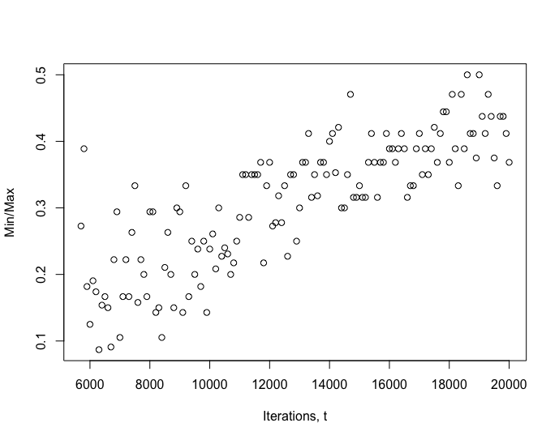
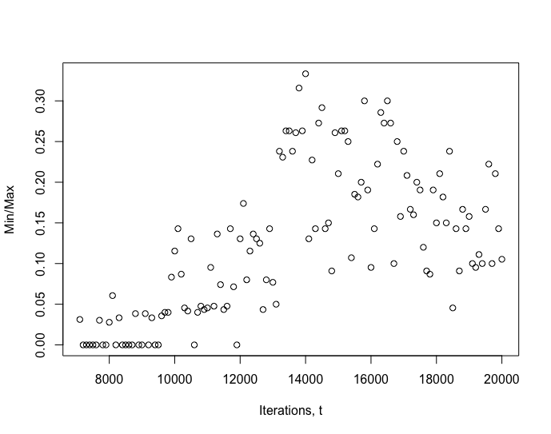
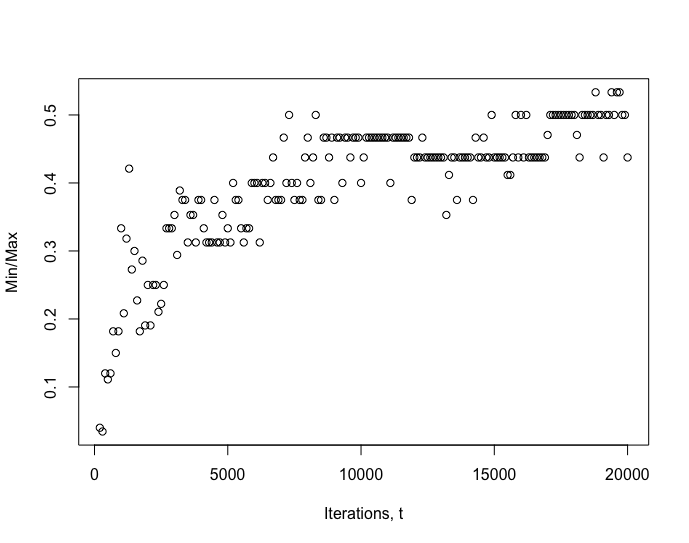
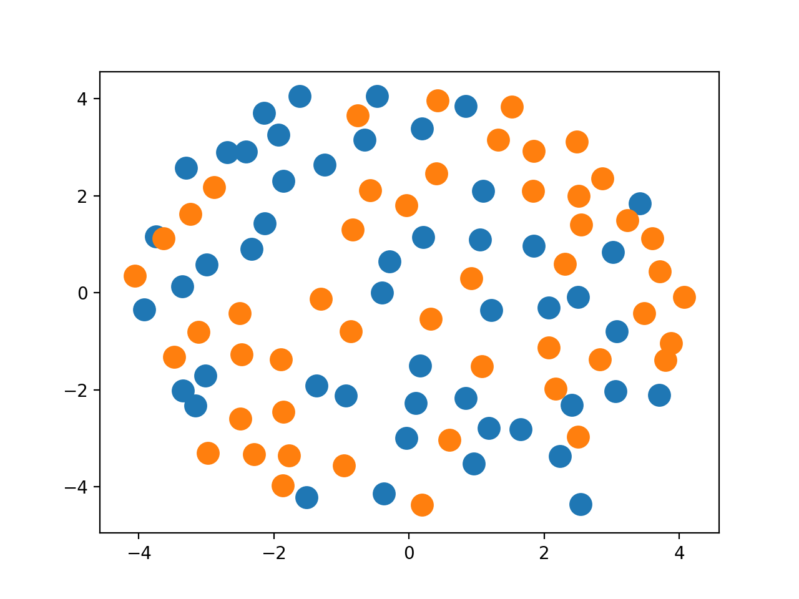
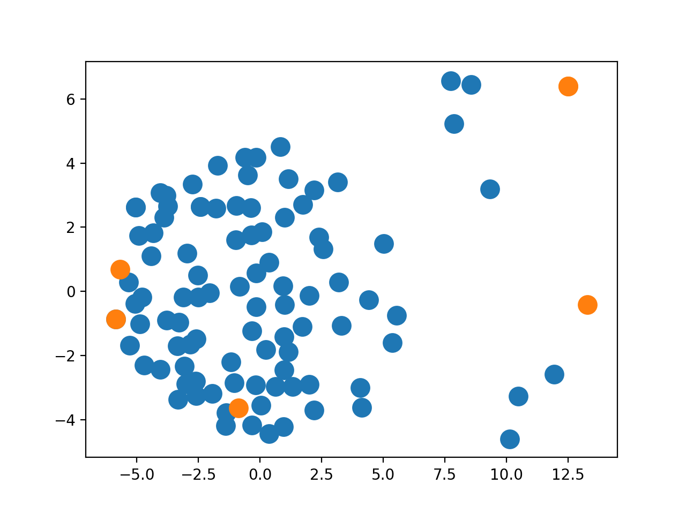

# Monte Carlo for Redistricting
There have been numerous attempts to apply Monte Carlo techniques to quantify the process of political redistricting in the United States. Due to the need for extensive optimisation and the lack of a 
one size fits all approach, previous methods do not translate well to the UK. In the following project, I have implemented a number of popular techniques to this end, making them applicable to the structure of the UK electoral system. 
Building upon this, I have created new algorithms that perform better under our system than existing models.

## Getting started 

### Prerequisites 
To run these algorithms, the following packages are required: 
numpy, fiona, random, geopandas, csv, shapely, itertools, scipy, cvxpy

### Required Data
The data input type is modelled around what is available from the Office of National Statistics. Any data source can be used however, lookup tables and data sets from the ONS will be already be in the correct format. Within the folder data, there is an example for each one of these require data types, pertaining to the wards of the West Midlands. 

#### Main Dataframe - df
Type: Pandas DataFrame
Columns (must be in the following order):  unique ward code, ward population

#### Shape file - shapefile
Type: .shp
Column: a column named ‘geometry’ with ward shape data in, must be type shapely polygons. The data must be in the same order as the data in df.

#### Ordinance Survey Area data - OAframe
Type: Dataframe
Columns (in the following order): unique OA code, population, ward code that contains OA area

#### Ward Adjacency lists - adjlist
Type: csv 
File with each row containing a list of df index numbers corresponding to wards that are adjacent geographically. The file should be structured such that each row features information about a single ward and each column contains a index. This file can be created using the function neighbours in MCMC_functions.py, if provided with the ward shape file. 

#### OA ward relationships - OAcol
type: csv 
File with each row containing a list of unique OA codes corresponding to OAs that are contained inside a specific ward (corresponding to that row). The file should be structured such that each row features information about a single ward and each column contains a unique OA code. This file can be created using the function OAcol in MCMC_functions.py, if provided with the OAdataframe. 

#### NOTE: 
If data relating to OA areas (OAcol and OAframe) is not available, or the user does not want to use MMI compactness, these files can be omitted. All MCMC algorithms will not require these files by default. 

## Running the algorithms

%GIF of all the algorithms running on a map - place at the start of each algorithm description. Make the %GIFs from runs given in exampleruns.py, so they can be replicated by the user. 
%Complete Rodden RoddenWang comparison
%Check code working RoddenWang and starting points

### FlipSwap
This algorithm is a basic boundary altering MCMC that changes the electoral layout by reassigning wards between constituencies. There are three different modes: Random, FlipSwap and Flip. Random selects a ward at random each iteration and changes its constituency assignment with probability one. Flip does the same procedure but changes the assignment with a probability based upon the Gibbs distribution. At each iteration, FlipSwap either runs the Flip algorithm with probability, p, based upon the population energy from iteration t-1, or with 1-p it runs the Random algorithm and then makes a counter swap, where a ward from the constituency W has just been assigned to is assigned to the constituency that W was previously assigned to. This combination of two flips is then accepted with a probability based on the Gibbs distribution, otherwise neither flip is made. The combination of two flips is called a swap, hence the name FlipSwap. 

The structure of the flip algorithm is modelled on several existing algorithms, notably one proposed by Chikina, available at: https://www.pnas.org/content/114/11/2860. I believe the addition of a conditional swap is a novel contribution and will not be found outside this package. Please see the Performance section below for comparisons between the methods.

#### Arguments
df: the dataframe with the same name produced by the function initialise. 

condf: the dataframe with the same name produced by the function initialise.

pop_constraint: a decimal float that corresponds to the percentage deviance from the mean population the redistricting will tolerate.

comp_constraint: a decimal float that corresponds to the minimum compactness score the algorithm will tolerate.

alg_type: 'R', 'F' or 'FS' for Random, Flip or FlipSwap as described in the section FlipSwp above. 

comp (default 'area'): 'area' or 'MMI' depending on whether an area compactness metric or 'MMI' compactness metric is desired. If 'MMI' the OA data OAcol and OAframe are required. 

relabel (default 'by location'): 'bynumber' or 'bylocation' depending on which way the output should be labelled. By number relabels constituencies numerically in order of appear in the vector, bylocation orders them with respect to the first map presented to that constituency movement is minimised. 

OAframe (default None): the OAframe data that is produced by the function initialise and is required for MMI compactness.

#### Output
Returns a list of tuples. In each tuple the first element, element 1, is a vector which describes the assignment of the wards: the index of each element in the list corresponds to the index of a ward in df and the value corresponds to the numeric code of a constituency. The second element, element 2, is the Gibbs value that was returned in order to move into the state described by element 1. 

### Swendsen-Wang
The Swendsen-Wang algorithm is based on a modification of the original Swendsen-Wang algorithm, described by Fifield in his paper: https://imai.fas.harvard.edu/research/files/redist.pdf. The process starts from a given map and through the process of picking edges at random changes the constituency assignment of multiple wards at a time.

#### Arguments
df: the dataframe with the same name produced by the function initialise.

condf: the dataframe with the same name produced by the function initialise.

pop_constraint: a decimal float that corresponds to the percentage deviance from the mean population the redistricting will tolerate.

comp_constraint: a decimal float that corresponds to the minimum compactness score the algorithm will tolerate 
alg_type: 'R', 'F' or 'FS' for Random, Flip or FlipSwap as described in the section FlipSwp above. 

comp (default 'area'): 'area' or 'MMI' depending on whether an area compactness metric or 'MMI' compactness metric is desired. If 'MMI' the OA data OAcol and OAframe are required. 

relabel (default 'by location'): 'bynumber' or 'bylocation' depending on which way the output should be labelled. By number relabels constituencies numerically in order of appear in the vector, bylocation orders them with respect to the first map presented to that constituency movement is minimised. 

OAframe (default None): the OAframe data that is produced by the function initialise and is required for MMI compactness.

#### Output
Returns a list of tuples. In each tuple the first element, element 1, is a vector which describes the assignment of the wards: the index of each element in the list corresponds to the index of a ward in df and the value corresponds to the numeric code of a constituency. The second element, element 2, is the Gibbs value that was returned in order to move into the state described by element 1. 

### Rodden
A constructive algorithm proposed by Chen and Rodden, available at http://citeseerx.ist.psu.edu/viewdoc/download?doi=10.1.1.397.5148&rep=rep1&type=pdf. The method starts from the unique map where each ward belongs to a single constituency. It then combines wards using a certain degree of randomness until there are a given number of constituencies. This initial process is followed by a deterministic process that aims to even out the populations between the constituencies, in order to satisfy population and compactness constraints. I have developed a modification to this process, where by the second stage of the algorithm, formally a deterministic "evening" procedure, is replace by the Swendsen-Wang method, detailed above.

#### Arguments
df: the dataframe with the same name produced by the function initialise. 

condf: the dataframe with the same name produced by the function initialise.

pop_constraint: a decimal float that corresponds to the percentage deviance from the mean population the redistricting will tolerate.

comp_constraint: a decimal float that corresponds to the minimum compactness score the algorithm will tolerate 
alg_type: 'R', 'F' or 'FS' for Random, Flip or FlipSwap as described in the section FlipSwp above. 

comp (default 'area'): 'area' or 'MMI' depending on whether an area compactness metric or 'MMI' compactness metric is desired. If 'MMI' the OA data OAcol and OAframe are required. 

relabel (default 'by location'): 'bynumber' or 'bylocation' depending on which way the output should be labelled. By number relabels constituencies numerically in order of appear in the vector, bylocation orders them with respect to the first map presented to that constituency movement is minimised. 

method (default 'Normal'): 'Normal' or 'RoddenWang', this dictates which procedure the second part of the algorithm follows. 

OAframe (default None): the OAframe data that is produced by the function initialise and is required for MMI compactness.

#### Output
Returns a list of tuples. In each tuple the first element, element 1, is a vector which describes the assignment of the wards: the index of each element in the list corresponds to the index of a ward in df and the value corresponds to the numeric code of a constituency. In order to maintain consistency of output, a second element, element 2, is provided but the value is meaningless.

## Performance

### MCMC Algorithms
In this section I demonstrate the use of all the algorithms described above and provide evidence of the superior performance of my modifications. 

In the following figure I show the convergence to a uniform distribution for the two methods FlipSwap and Flip. The y axis shows the frequency the map that is found by the algorithm the least, divided by the frequency of the map that is found the most. This measure converges to 1 as the distribution of maps converges to uniform. The x axis shows the iteration number t. 
It can be see that the FlipSwap demonstrates better convergence toward the desired uniform distribution over 20,000 iterations. 

FlipSwap Convergence | Flip Convergence | Swendsen-Wang Convergence
:--------------------:|:--------------------:|:------------------:
||

### Constructive Algorithms
I demonstrate the advantages of the RoddenWang modification, in comparison with the original proposal by Chen and Wang. Below we have maps in orange generated by the Rodden Algorithm with RoddenWang turned on. These are placed alongside maps in blue that are sampled randomly from the distribution of all maps. In this graph the distance between maps is a euclidean distance. It can be seen that the RoddenWang is generating maps that are well dispersed and representative of the whole space.

RoddenWang | 
:--------------------:|

## Additional Methods 

### Distance 
Takes a distribution list and calculates a pairwise lifted Wasserstein distance between any two of the maps. 

#### Arguments
adjlist: the adjacency relations between wards, sufficient to provide df['neighbours']. 

refdist: the distribution list that is output by one of the MCMC chains and contains the maps from which you wish to measure distance.

i: the index of the first maps within refdist (only primary index is required. e.g. for the first map 0 not 0,0 is required)

j: the index of the second map within refdist (only primary index is required. e.g. for the second map 1 not 1,0 is required)

#### Output
A pairwise distance between two maps

### Starting Points
Using lifted Wasserstein distance embedded in a euclidean space, the algorithm finds a given number of dispersed points from a given list distribution. This is a recommended method for generating starting points. For this purpose we recommend the Rodden Algorithm and its variate since they generate independent maps. 

#### Arguments
adjlist: the adjacency relations between wards, sufficient to provide df['neighbours']. 

refdist: the distribution list that is output by one of the MCMC chains and contains the maps from which you wish to measure distance.

num: the number of maps to be returned

#### Output
A given number of overly dispersed maps

The figure above shows the selection of 5 overly dispersed maps. Each point represents a map embedded in euclidean space. 
